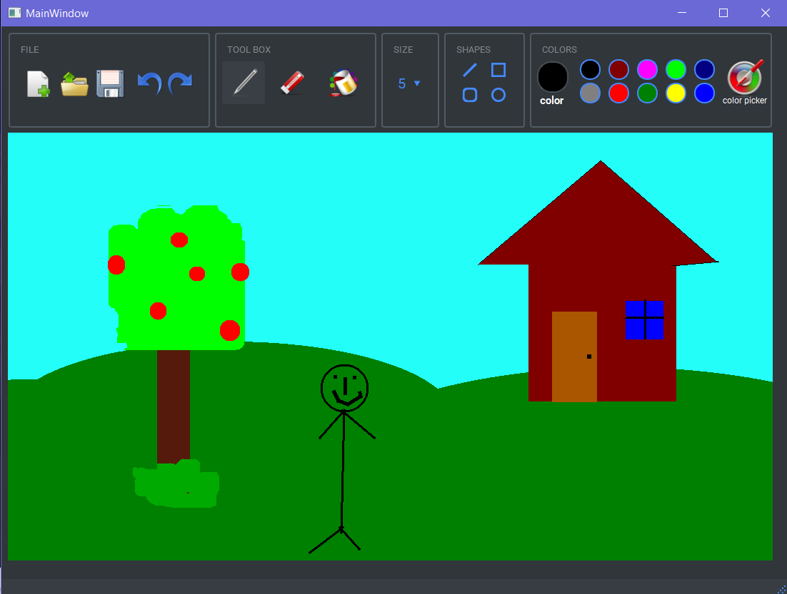

# Paint

a simple paint app with pyqt5

 - you can open a file and edit it
 - you can save your drawing
 - draw with pen tool or use shapes to draw
 - you can fill all of screen or part of it with fill tool
 - correct your mistakes by using eraser or undo button
 - set you pen size easily
 - use the 12 main colors or make your own color py color picker

